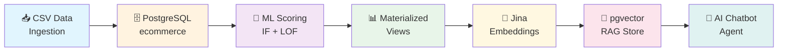
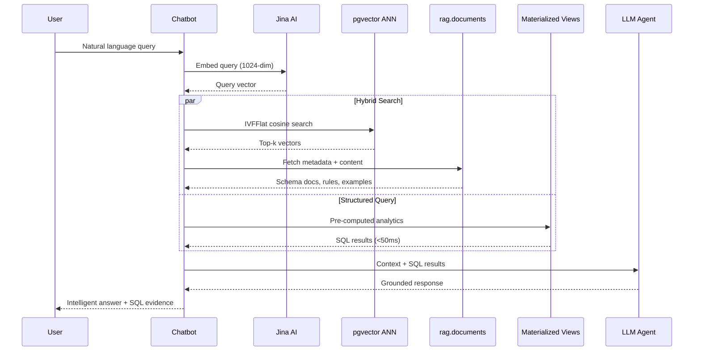
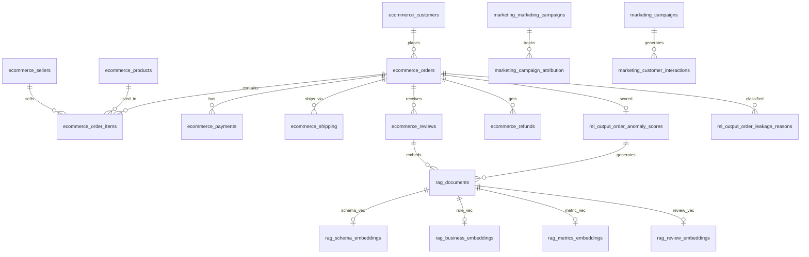
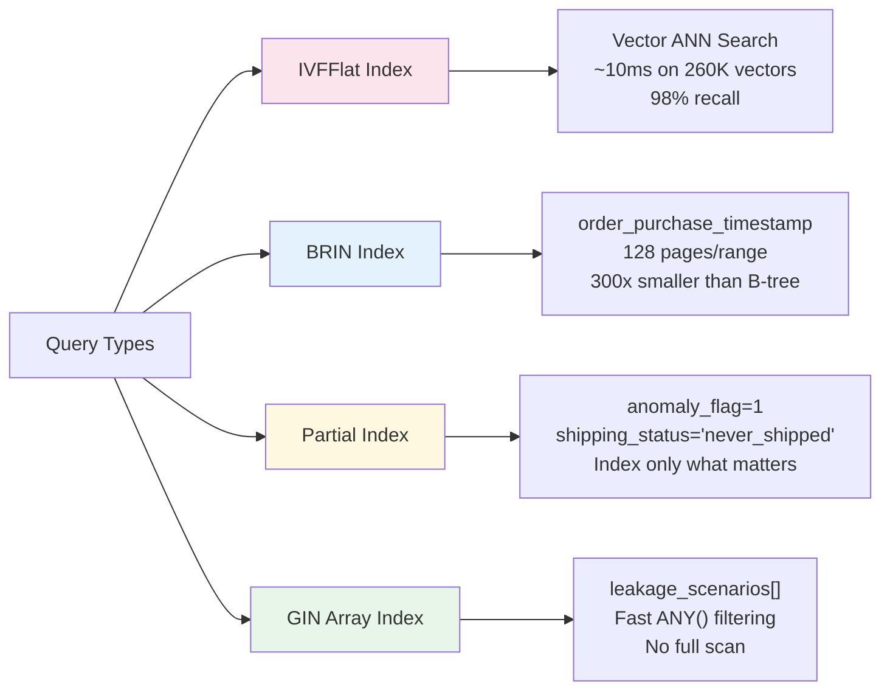
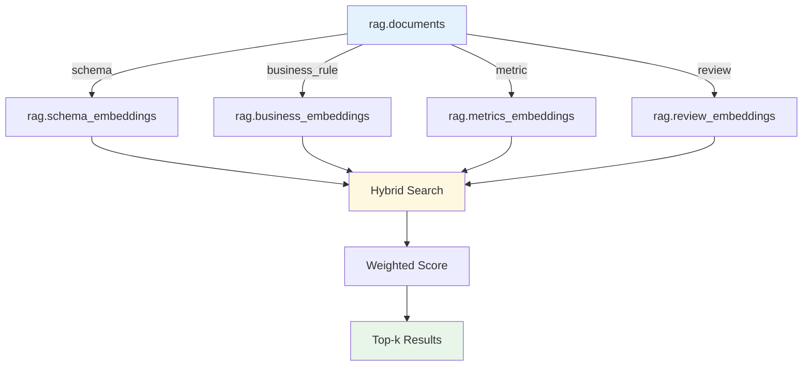

<div align="center">

# 🧠 Revenue Intelligence RAG Platform

<p align="center">
  
  
  
  
  
</p>

<p align="center">
  <b>AI-Powered PostgreSQL + pgvector System for Real-Time Revenue Leakage Detection, Semantic Search & Intelligent Analytics</b>
</p>

<p align="center">
  <a href="#-system-architecture">Architecture</a> •
  <a href="#-database-design">Database</a> •
  <a href="#-vector-database--rag">RAG</a> •
  <a href="#-performance-engineering">Performance</a> •
  <a href="#-setup-guide">Setup</a> •
  <a href="#-example-queries">Queries</a>
</p>

</div>

---

## 📋 Table of Contents

- [Project Overview](#-project-overview)
- [System Architecture](#-system-architecture)
- [Database Design](#-database-design)
- [Vector Database & RAG](#-vector-database--rag)
- [Query Optimization & Performance](#-query-optimization--performance)
- [Project Structure](#-project-structure)
- [Setup Guide](#-setup-guide)
- [Example Queries](#-example-queries)
- [Technical Highlights](#-technical-highlights)
- [Challenges & Engineering Decisions](#-challenges--engineering-decisions)
- [Future Roadmap](#-future-roadmap)

---

## 🎯 Project Overview

### The Business Problem

Revenue leakage — the silent profit killer. In e-commerce operations, revenue disappears through:
- **Operational errors**: Duplicate refunds, incorrect shipping fees, inventory mismatches
- **Payment failures**: Delivered orders without payment, partial payments, COD uncollected
- **Policy gaps**: High discounts causing negative margins, refunds before cancellations
- **Fraud patterns**: Sellers paid twice, fake delivery confirmations

Traditional databases can store this data, but they cannot **understand** it. Keyword queries miss semantic relationships. Static reports arrive too late. Analysts spend hours writing SQL for questions that should be instant.

### Why This Architecture?

| Capability | Traditional RDBMS | Standalone Vector DB | **This System** |
|:---|:---|:---|:---|
| Semantic Search | ❌ Not supported | ✅ Primary use case | ✅ Native pgvector |
| ACID Transactions | ✅ Full support | ❌ Limited / none | ✅ Full PostgreSQL |
| JOIN with Business Data | ✅ SQL joins | ❌ Requires ETL sync | ✅ **Single query** |
| Infrastructure Complexity | ✅ Simple | ❌ Extra service + sync | ✅ **One container** |
| Typed Enums + Constraints | ✅ Supported | ❌ Schema-less | ✅ Full type safety |
| Materialized Views | ✅ Standard | ❌ Not applicable | ✅ 4 MVs + CONCURRENTLY |
| Incremental Re-embedding | ❌ Manual | ❌ Full re-index | ✅ `needs_reembedding` flag |

### Why AI-Ready?

This is not a CRUD database. It is a **production AI infrastructure** where:
- Embeddings live alongside transactional data — zero ETL overhead
- Semantic search joins with SQL filters in single queries
- Materialized views serve sub-50ms responses to chatbot agents
- SQL guardrails prevent injection and hallucinations
- Incremental pipelines re-embed only changed documents

> 💡 **Design Philosophy**: One PostgreSQL instance delivers what traditionally required a data warehouse, a vector database, an ML pipeline, and a separate chatbot service.

---

## 🏗️ System Architecture

### End-to-End Data Flow



### System Layers

| Layer | Responsibility | Key Components |
|:---|:---|:---|
| **📦 Data Layer** | Core transactional data | `ecommerce` schema — 298K orders, 253K customers, 435K order items |
| **🧠 Intelligence Layer** | ML scoring & chatbot ops | `ml_output` schema — anomaly scores, leakage reasons, materialized views, conversation logs |
| **🔍 Vector Layer** | Semantic retrieval & RAG | `rag` schema — documents, typed embeddings, retrieval cache, SQL guard |
| **🛡️ Safety Layer** | Security & validation | `sql_guard`, `chatbot_readonly` role, statement timeouts |
| **📈 Marketing Layer** | Campaign attribution | `marketing` schema — 1.26M sessions, 1M interactions, lead pipeline |

### RAG Pipeline Architecture



### Query Lifecycle


---

## 🗄️ Database Design

### Schema Architecture



### Four-Schema Design

#### 1. `ecommerce` — Transactional Core

| Table | Rows | Purpose | Key Features |
|:---|:---|:---|:---|
| `orders` | 298K | Core fact table | GENERATED columns: `order_month`, `order_quarter`, `fee_to_cost_ratio` |
| `customers` | 253K | Customer profiles | `lifetime_value`, `segment`, `churn_risk` |
| `order_items` | 435K | Line items | `price_after_discount` — correct revenue column |
| `payments` | 297K | Payment records | Filter `payment_sequential = 1` for primary method |
| `shipping` | 298K | Delivery tracking | `fee_to_cost_ratio` GENERATED for anomaly detection |
| `reviews` | 262K | Customer feedback | `sentiment` ENUM, `has_comment` flag |
| `refunds` | 7.8K | Refund records | `duplicate_refund`, `processed_before_cancel` flags |
| `products` | 50K | Product catalog | `unit_price_egp` vs actual `price_after_discount` |
| `sellers` | 5K | Seller profiles | `return_rate`, `payment_disputes` risk signals |

#### 2. `ml_output` — Intelligence Layer

| Component | Purpose | Performance |
|:---|:---|:---|
| `order_anomaly_scores` | IF + LOF ensemble scoring | One row per order, sub-second scoring |
| `order_leakage_reasons` | Junction table for scenarios | Preferred over `ANY(array)` filtering |
| `mv_leakage_dashboard` | Pre-JOINED order view | **<50ms** — no runtime JOINs |
| `mv_monthly_leakage` | Monthly aggregates | `leakage_rate_pct` pre-computed |
| `mv_seller_risk` | Seller risk profile | `leakage_rate_pct` DESC ranking |
| `mv_leakage_by_scenario` | Scenario comparison | `revenue_at_risk` per scenario |
| `chatbot_conversations` | Multi-turn history | `session_id` + `turn_index` reconstruction |
| `chatbot_prompt_versions` | A/B tested prompts | `is_active` partial unique index |
| `chatbot_query_log` | Full observability | Cost tracking, latency, hallucination flags |

#### 3. `rag` — Vector & Retrieval Engine

| Component | Type | Dimensions | Purpose |
|:---|:---|:---|:---|
| `documents` | Base table | — | Source chunks with metadata, versioning, priority |
| `schema_embeddings` | Vector | 1024 | Table schemas, join graphs, enum references |
| `business_embeddings` | Vector | 1024 | Leakage scenarios, business rules |
| `metrics_embeddings` | Vector | 1024 | KPI definitions, anomaly interpretations |
| `review_embeddings` | Vector | 1024 | Customer reviews, sentiment analysis |
| `retrieval_cache` | Cache | — | `query_hash` → `result_json` deduplication |
| `retrieval_log` | Audit | — | Hallucination tracking, confidence scores |
| `sql_guard` | Security | — | Pattern-based SQL injection prevention |

#### 4. `marketing` — Attribution & Pipeline

| Table | Rows | Purpose |
|:---|:---|:---|
| `marketing_campaigns` | 184 | Campaign definitions with budget |
| `leads_qualified` | 24K | Marketing qualified leads |
| `leads_closed` | 7.2K | Won deals with revenue declarations |
| `campaign_attribution` | 208K | Order-to-campaign mapping |
| `website_sessions` | 1.26M | Session logs with bounce detection |
| `customer_interactions` | 1M | Cross-channel event stream |

### Indexing Strategy



| Index Type | Target | Benefit |
|:---|:---|:---|
| **IVFFlat** | `rag.*_embeddings` | O(√n) approximate NN — 4× speedup at 98% recall |
| **BRIN** | `orders.order_purchase_timestamp` | 300× smaller than B-tree for append-only data |
| **Partial** | `anomaly_flag=1`, `shipping_status='never_shipped'` | Index only leakage-relevant rows |
| **GIN** | `leakage_scenarios[]` | Fast `WHERE 'scenario' = ANY(leakage_scenarios)` |
| **GIN** | `rag.documents.content_tsv` | BM25 full-text search for hybrid retrieval |

---

## 🔍 Vector Database & RAG

### Embedding Architecture



### Document Types & Priorities

| `source_type` | Count | `embedding_type` | Priority | Purpose |
|:---|:---|:---|:---|:---|
| `schema_doc` | 12 | `schema` | 7-10 | Table schemas, join graphs, enum refs |
| `leakage_scenario` | 20 | `business_rule` | 7-10 | Detection rules, SQL templates |
| `sql_template` | 7 | `sql_template` | 10 | Pre-built query patterns |
| `kpi_glossary` | 4 | `metric` | 7-9 | Business metric definitions |
| `review` | 30K | `review` | 2-5 | Customer feedback with sentiment |
| `leakage_reason` | ~37K | `business_rule` | 3-8 | Per-order leakage reports |

### Hybrid Search Algorithm

```sql
-- BM25 + Vector fusion with per-source-type diversity
WITH bm25_results AS (
    SELECT doc_id, ts_rank_cd(content_tsv, query) AS bm25_score
    FROM rag.documents WHERE content_tsv @@ query
),
vector_results AS (
    SELECT doc_id, 1 - (embedding <=> query_vec) AS vector_score
    FROM rag.schema_embeddings  -- + business + metrics + review
),
combined AS (
    SELECT COALESCE(b.doc_id, v.doc_id) AS doc_id,
           COALESCE(bm25_score, 0) * 0.4 + COALESCE(vector_score, 0) * 0.6 AS hybrid_score
    FROM bm25_results b FULL JOIN vector_results v USING(doc_id)
)
SELECT * FROM combined
JOIN rag.documents d USING(doc_id)
WHERE is_active = TRUE
ORDER BY hybrid_score DESC, priority DESC
LIMIT 8;
```

### Retrieval Pipeline

```mermaid
sequenceDiagram
    participant Pipeline
    participant DB as PostgreSQL
    participant Jina as Jina AI API

    Pipeline->>DB: SELECT pending docs WHERE needs_reembedding = TRUE
    DB-->>Pipeline: Batch of 50 documents

    Pipeline->>Pipeline: Enrich: title + "

" + content

    Pipeline->>Jina: POST /v1/embeddings (task=retrieval.passage)
    Jina-->>Pipeline: 1024-dim vectors

    Pipeline->>Pipeline: Validate dimensions
    Pipeline->>DB: execute_values bulk upsert
    Pipeline->>DB: UPDATE needs_reembedding = FALSE

    Note over Pipeline,DB: Atomic transaction — rollback on failure
```

### Key RAG Features

| Feature | Implementation | Benefit |
|:---|:---|:---|
| **Typed Embeddings** | 4 separate tables by `embedding_type` | Clean separation, optimized queries |
| **Incremental Re-embedding** | `needs_reembedding` boolean flag | Only changed docs re-processed |
| **Priority Weighting** | `priority` (1-10) + `retrieval_weight` | Critical docs surface first |
| **Hybrid Scoring** | BM25 × 0.4 + Cosine × 0.6 | Keyword + semantic coverage |
| **Source Diversity** | Max 2 docs per `source_type` in top-k | Prevents review domination |
| **Query Cache** | `retrieval_cache` with TTL | Identical queries skip embedding API |
| **Versioning** | `document_versions` audit trail | Rollback + change tracking |

---

## ⚡ Query Optimization & Performance

### Performance Benchmarks

| Metric | Value | Technique |
|:---|:---|:---|
| Materialized View Queries | **<50ms** | Pre-computed JOINs, CONCURRENT refresh |
| Vector ANN Search | **~10ms** | IVFFlat, lists=100, 260K+ vectors |
| IVFFlat Complexity | **O(√n)** | Nearest centroid probe only |
| BRIN Index Size | **300× smaller** | 128 pages per range vs B-tree |
| Embedding Pipeline | **50 docs/batch** | Jina API with exponential backoff |
| Cache Hit Rate | **24hr TTL** | `query_hash` deduplication |

### Materialized View Strategy

```sql
-- Refresh all analytics views concurrently (no locks)
CALL ml_output.refresh_all_views();

-- The chatbot NEVER queries raw tables. Always MVs:
SELECT * FROM ml_output.mv_leakage_dashboard 
WHERE anomaly_flag = 1 
  AND risk_tier = 'Critical'
ORDER BY ensemble_score DESC
LIMIT 50;
```

### Query Optimization Decisions

| Decision | Rationale |
|:---|:---|
| **MVs over raw JOINs** | Eliminates 6-table JOINs at query time |
| **GENERATED columns** | `order_month`, `order_quarter` — no runtime DATE_TRUNC |
| **`payment_sequential = 1` filter** | Prevents installment row duplication |
| **`price_after_discount` for revenue** | Correct post-discount calculation |
| **Junction table for scenarios** | `order_leakage_reasons` — faster than `ANY(array)` |
| **Partial indexes on flags** | Only index rows that match leakage patterns |

---

## 📁 Project Structure

```
revenue-intelligence-rag/
│
├── 📂 schema/                          # Database schema & migrations
│   ├── vector_db_RAG.sql               # Full RAG schema + documents + functions
│   ├── ml_data_modification.sql        # ML scoring data pipeline
│   ├── final.sql                       # CSV import script
│   └── ecommerce_schema.sql            # Base transactional schema
│
├── 📂 schema_output/                   # Auto-generated documentation
│   ├── llm_schema_context.txt          # ★ Runtime agent context (~38KB)
│   ├── DATABASE_DOCUMENTATION.md       # Human-readable docs (~37KB)
│   ├── rag_documents.json              # Enriched RAG source documents
│   ├── columns.json                    # All columns + comments + generated flags
│   ├── enums.json                      # All ENUM types & valid values
│   ├── foreign_keys.json               # Complete relationship map
│   ├── indexes.json                    # Index definitions + partial flags
│   ├── materialized_views.json         # MV columns + comments
│   ├── sample_rows.json                # Anonymized sample data
│   ├── schema_metadata.json            # Chatbot table selection guide
│   └── chatbot_enums.json              # LLM prompt ENUM injection
│
├── 📂 pipeline/                        # Data & embedding pipelines
│   ├── extract_schema.py               # Schema extraction + context builder
│   └── embedding_pipeline.py           # Jina AI → pgvector sync
│
├── 📂 erds/                            # Entity relationship diagrams
│   ├── full_schemas.png                # Complete 4-schema ERD
│   ├── ecommerce_schema_erd.html       # Interactive ecommerce ERD
│   ├── ml_output_schema_erd.html       # Interactive ML schema ERD
│   └── rag_schema_erd.html             # Interactive RAG schema ERD
│
├── 📂 presentations/                   # Architecture documentation
│   ├── pgvector_RAG_Revenue_Intelligence6.pptx
│   └── rag_presentation.html
│
├── 📂 docker/                          # Container orchestration
│   └── docker-compose.yml              # PostgreSQL 17 + pgvector
│
├── 📂 docs/                            # Additional documentation
│   └── ARCHITECTURE_DECISIONS.md
│
└── README.md                           # This file
```

---

## 🚀 Setup Guide

### Prerequisites

- Docker 24.0+
- PostgreSQL 17 (or use Docker)
- Python 3.11+
- Jina AI API key

### 1. Docker Setup (Recommended)

```bash
# Pull official pgvector image
docker pull pgvector/pgvector:pg17

# Run container with persistent volume
docker run -d   --name revenue-intelligence   -p 5433:5432   -e POSTGRES_PASSWORD=postgres   -e POSTGRES_DB=revenue_leakage   -v pgdata:/var/lib/postgresql/data   pgvector/pgvector:pg17

# Verify pgvector extension
docker exec -it revenue-intelligence psql -U postgres -d revenue_leakage -c "CREATE EXTENSION vector;"
```

### 2. Schema Installation

```bash
# Connect to database
psql -h localhost -p 5433 -U postgres -d revenue_leakage

# Execute schema scripts in order:
\i schema/ecommerce_schema.sql      # Base tables + data
\i schema/vector_db_RAG.sql          # RAG schema + documents + functions
\i schema/ml_data_modification.sql   # ML scoring pipeline
```

### 3. Embedding Pipeline Configuration

```python
# pipeline/embedding_pipeline.py
JINA_API_KEY = "your-api-key-here"   # Get from https://jina.ai
JINA_MODEL = "jina-embeddings-v5-text-small"  # 1024-dim

DB_CONFIG = {
    "dbname": "revenue_leakage",
    "user": "postgres",
    "password": "postgres",
    "host": "localhost",
    "port": "5433"
}

BATCH_SIZE = 50   # Docs per API call
MAX_RETRIES = 3   # Exponential backoff
```

### 4. Run Embedding Pipeline

```bash
cd pipeline
python embedding_pipeline.py

# Expected output:
# INFO - Found 37266 documents pending embedding
# INFO - Embedding dimension detected: 1024
# INFO - Batch 1 done | Processed: 50/37266
# ...
# INFO - EMBEDDING PROCESS COMPLETE
# INFO - Total successfully processed: 37266
```

### 5. Verify Installation

```sql
-- Check document counts by type
SELECT source_type, COUNT(*) 
FROM rag.documents 
GROUP BY source_type 
ORDER BY COUNT(*) DESC;

-- Verify embeddings exist
SELECT embedding_type, COUNT(*) 
FROM rag.documents d
JOIN rag.schema_embeddings s ON d.doc_id = s.doc_id
GROUP BY embedding_type;

-- Test hybrid search
SELECT * FROM rag.hybrid_search(
    'duplicate refund detection',
    NULL,  -- all source types
    NULL,  -- no vector (BM25 only)
    5      -- top 5
);
```

---

## 📝 Example Queries

### Semantic Search (Vector Only)

```sql
-- Find schema docs semantically similar to "seller risk"
SELECT d.title, d.content,
       1 - (e.embedding <=> query_embedding) AS similarity
FROM rag.schema_embeddings e
JOIN rag.documents d ON e.doc_id = d.doc_id
WHERE d.source_type = 'schema_doc'
ORDER BY e.embedding <=> query_embedding
LIMIT 5;
```

### Hybrid RAG Retrieval

```sql
-- Full hybrid search with source filtering
SELECT * FROM rag.hybrid_search(
    p_query := 'high discount negative profit',
    p_source_types := ARRAY['leakage_scenario', 'sql_template']::rag.rag_source_t[],
    p_embedding := NULL,  -- auto-embed via trigger or app layer
    p_top_k := 8,
    p_vector_weight := 0.6,
    p_bm25_weight := 0.4
);
```

### Chatbot Analytics Query

```sql
-- Critical risk orders with pre-joined data (no JOINs needed!)
SELECT 
    order_id,
    customer_name,
    customer_city,
    total_revenue,
    profit_margin,
    risk_tier,
    ensemble_score,
    leakage_scenarios,
    payment_status,
    shipping_status
FROM ml_output.mv_leakage_dashboard
WHERE anomaly_flag = 1
  AND risk_tier = 'Critical'
  AND order_month >= '2024-01-01'
ORDER BY ensemble_score DESC
LIMIT 20;
```

### Seller Risk Analysis

```sql
-- Top 10 riskiest sellers (pre-computed)
SELECT 
    seller_name,
    seller_city,
    leakage_rate_pct,
    total_orders,
    leakage_orders,
    avg_anomaly_score,
    payment_disputes,
    return_rate
FROM ml_output.mv_seller_risk
WHERE total_orders > 100  -- statistical significance
ORDER BY leakage_rate_pct DESC
LIMIT 10;
```

### Monthly Trend Analysis

```sql
-- Leakage trend over time (no GROUP BY needed!)
SELECT 
    month_label,
    total_orders,
    leakage_orders,
    ROUND(leakage_rate_pct, 2) AS leakage_rate,
    total_revenue,
    revenue_at_risk
FROM ml_output.mv_monthly_leakage
ORDER BY month DESC
LIMIT 12;
```

### SQL Guard Validation

```sql
-- Test that generated SQL is safe
SELECT * FROM rag.validate_sql(
    'SELECT SUM(orders.amount) FROM ecommerce.payments WHERE order_id = ''X'''
);
-- Returns: fake_column | orders.amount | Column does not exist. Use orders.total_revenue
```

---

## 🏆 Technical Highlights

### Advanced Database Engineering

| Technique | Implementation | Impact |
|:---|:---|:---|
| **Multi-Schema Architecture** | 4 schemas with clear separation | Maintainability, security, performance |
| **Typed Vector Storage** | 4 embedding tables by domain | Query optimization, clean separation |
| **Hybrid BM25 + Vector** | `ts_rank_cd` + cosine similarity | Keyword coverage + semantic understanding |
| **Incremental Re-embedding** | `needs_reembedding` flag | 100× faster than full re-index |
| **Document Versioning** | `document_versions` audit trail | Rollback, compliance, debugging |
| **Retrieval Cache** | `query_hash` → `result_json` | Reduces API costs, <1ms cache hits |
| **SQL Injection Guard** | `rag.validate_sql()` function | Pattern-based blocking + regex |
| **Read-Only Security** | `chatbot_readonly` role | 15s statement timeout, SELECT-only |
| **Hallucination Tracking** | `retrieval_log` with confidence | Monitor fabricated patterns |
| **Prompt A/B Testing** | `chatbot_prompt_versions` | `auc_score`, `avg_f1` per version |

### AI Infrastructure Design

- **Embedding Pipeline**: Batch processing with exponential backoff, dimension validation, atomic transactions
- **Intent Routing**: 6 query intents mapped to optimal data sources (MVs vs raw tables)
- **Context Injection**: Retrieved schema docs + SQL results fed to LLM for grounded generation
- **Anti-Pattern Detection**: Documents warn against common mistakes (using `price` instead of `price_after_discount`)

### Scalability Engineering

- **CONCURRENTLY Refreshed MVs**: No table locks during refresh
- **BRIN Indexes**: 300× smaller for time-series data
- **Partial Indexes**: Only index leakage-relevant subsets
- **Connection Pooling**: psycopg2 with session reuse
- **Batch API Calls**: 50 docs/batch to respect rate limits

---

## 🤔 Challenges & Engineering Decisions

### 1. Why pgvector over Pinecone/Qdrant?

**Decision**: Use pgvector inside PostgreSQL rather than a standalone vector database.

**Rationale**:
- Zero ETL — embeddings live with transactional data
- Single query joins vectors with business logic
- ACID compliance for embedding + document updates
- Existing PostgreSQL ops team — no new infrastructure

**Tradeoff**: Billion-scale vectors may require sharding (Citus) or read replicas.

### 2. Why IVFFlat over HNSW?

**Decision**: IVFFlat with 100 lists for 260K vectors.

**Rationale**:
- Faster build times for batch embedding pipeline
- 98% recall at 4× speedup over exact search
- O(√n) complexity ideal for current scale

**Tradeoff**: HNSW offers higher recall at extreme scale — migration path documented.

### 3. Why 4 Separate Embedding Tables?

**Decision**: `schema_embeddings`, `business_embeddings`, `metrics_embeddings`, `review_embeddings` instead of single table with type column.

**Rationale**:
- Query planner optimizes per-table indexes
- Cleaner application routing logic
- Easier partial re-indexing by domain

**Tradeoff**: Slightly more complex schema, managed by `EMBEDDING_TABLE_MAP` in pipeline.

### 4. Why Materialized Views over Views?

**Decision**: Pre-compute `mv_leakage_dashboard`, `mv_monthly_leakage`, `mv_seller_risk`, `mv_leakage_by_scenario`.

**Rationale**:
- Chatbot queries hit indexes, not raw tables
- Eliminates 6-table JOINs at query time
- CONCURRENT refresh allows reads during update

**Tradeoff**: Data freshness — refresh scheduled daily via pg_cron.

### 5. Why Arabic + English Bilingual Content?

**Decision**: All RAG documents include both languages with `content_lang = 'ar+en'`.

**Rationale**:
- Egyptian market requires Arabic support
- English aliases for technical terms
- Dual `to_tsvector` index: `arabic` + `english`

**Tradeoff**: Larger document size, requires proper Arabic text search config.

---

## 🔮 Future Roadmap

### Phase 2 — Active 🚧
**Chatbot Agent + Text-to-SQL**
- Wire RAG retrieval to Claude/GPT-4
- SQL generation with schema context injection
- `sql_guard` validation + full session logging

### Phase 3 — Planned 📋
**Real-Time Dashboard**
- Streamlit/Next.js dashboard consuming MVs
- Live leakage rate gauge, revenue-at-risk meter
- Auto-refresh via `pg_cron`

### Phase 4 — Planned 📋
**Automated Alerting**
- PostgreSQL `NOTIFY/LISTEN` for real-time triggers
- Webhook to Slack/email on Critical risk tier
- Configurable thresholds per scenario

### Phase 5 — Future 🔮
**Multi-Tenant + SaaS**
- Row-level security for tenant isolation
- Per-tenant embedding namespaces
- Usage-based billing + OpenAPI spec
- Horizontal scaling via Citus or read replicas

### Advanced RAG Techniques

| Technique | Status | Expected Impact |
|:---|:---|:---|
| **Cross-Encoder Re-ranking** | Planned | +15% precision on retrieval |
| **Hypothetical Document Embeddings (HyDE)** | Planned | Better query-document alignment |
| **Multi-modal Embeddings** | Future | Image + text product search |
| **Agentic RAG with Feedback Loops** | Future | Self-improving retrieval |
| **Distributed Vector Storage** | Future | Billion-scale with Citus |

---

## 📊 System Metrics

```
┌─────────────────────────────────────────┐
│  Revenue Intelligence RAG Platform    │
├─────────────────────────────────────────┤
│  Total Records        │  2.9M+          │
│  Leakage Scenarios    │  20             │
│  Vector Dimensions    │  1024           │
│  Query Latency        │  <50ms          │
│  Schemas              │  4              │
│  Materialized Views   │  4              │
│  Embedding Tables     │  4              │
│  ENUM Types           │  14             │
│  SQL Guard Rules      │  13             │
│  RAG Document Types   │  17             │
└─────────────────────────────────────────┘
```

---

## 🏢 Built For

**Production. Designed for Intelligence.**

A single PostgreSQL instance with pgvector delivers what traditionally required:
- ❌ Data warehouse for analytics
- ❌ Separate vector database (Pinecone/Qdrant)
- ❌ ML pipeline service
- ❌ Standalone chatbot backend

**One container. One source of truth. Enterprise-grade AI infrastructure.**

---

<p align="center">
  <sub>Built with PostgreSQL 17 • pgvector • Jina AI • Python • Docker</sub>
</p>

<p align="center">
  <sub>Revenue Intelligence System v3.1 | AI Infrastructure Team</sub>
</p>
