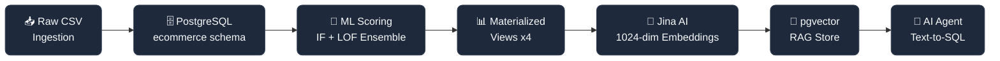
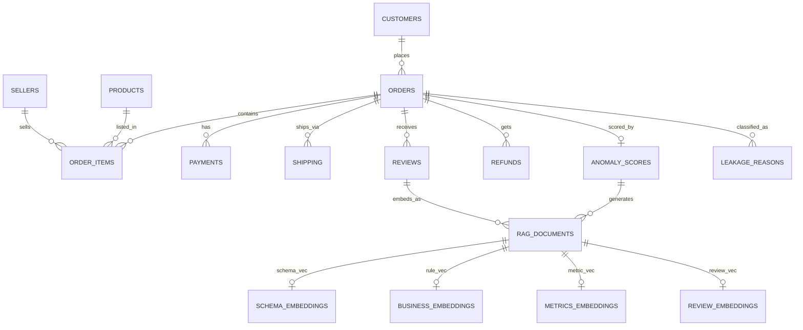
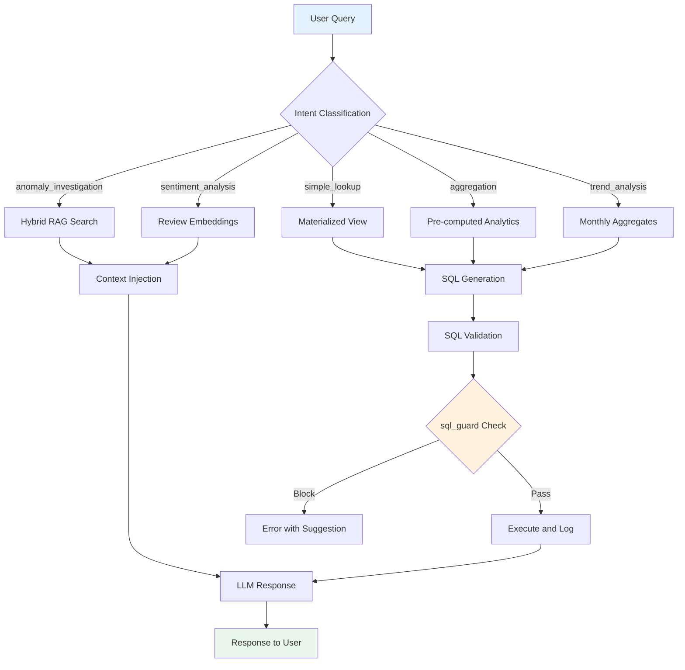

<div align="center">

# 🧠 Revenue Intelligence RAG Platform

<picture>
  <source media="(prefers-color-scheme: dark)" srcset="docs/assets/banner-dark.png">
  
</picture>

**Production AI infrastructure for real-time revenue leakage detection, semantic search, and natural-language analytics — built entirely inside PostgreSQL.**

<br/>

<p align="center">
  
  
  
  
  
</p>

<br/>

<a href="#-quick-start"></a>
<a href="#-system-architecture"></a>
<a href="#-data--database-backup"></a>

<br/>

| | |
|:---:|:---:|
| **2.9M+** records | **1,024-dim** vectors |
| **< 50ms** MV queries | **20** leakage scenarios |
| **4** schemas | **37K+** embedded documents |
| **~10ms** ANN search | **13** SQL guard rules |

<br/>

[Architecture](#-system-architecture) · [Database Design](#-database-design) · [Vector & RAG](#-vector-database--rag) · [SQL Agent](#-sql-agent--chatbot) · [Setup](#-quick-start) · [Queries](#-example-queries) · [Roadmap](#-roadmap)

</div>

---

## 📦 Data & Database Backup

### Access All Resources

**Complete data, database backups, and configuration files:**

🔗 **[Google Drive Folder](https://drive.google.com/drive/u/1/folders/1Kt4_jRISTsfQi03oQsEN8bIr1DnwfuJg)**

Contains:
- ✅ Full database backup (PostgreSQL 17 dump)
- ✅ CSV data files for ingestion
- ✅ Embedding cache and vector indices
- ✅ Configuration templates
- ✅ Sample queries and integration examples

**Setup Instructions:**
```bash
# Download backup from Google Drive folder
wget "[drive-link-to-backup.sql]"

# Restore database
psql -U postgres -d revenue_intelligence < backup.sql

# Verify setup
psql -U postgres -d revenue_intelligence -c "SELECT COUNT(*) FROM ecommerce.orders;"
```

---

## 🎯 The Core Insight

> **Traditional databases store revenue data. This system understands it.**

Revenue leakage is invisible in conventional reporting. Duplicate refunds, undelivered shipments that show as paid, negative-margin discounts — none of these trigger SQL alerts because nobody knows which query to write.

This platform combines:

- **Isolation Forest + LOF ensemble scoring** to flag anomalous orders automatically
- **pgvector semantic search** so analysts can ask questions in plain language
- **Pre-computed materialized views** that serve chatbot agents in under 50ms
- **SQL guardrails** that block hallucinated columns and injection patterns before execution
- **Incremental embedding pipelines** that re-process only changed documents

All of it in a single PostgreSQL 17 container. No data warehouse. No separate vector database. No ML service. One source of truth.

---

## 🏗️ System Architecture

### System Layers

```
┌─────────────────────────────────────────────────────────────────┐
│                     AI CHATBOT AGENT                            │
│          Natural language → SQL → Grounded response             │
└────────────────────────┬────────────────────────────────────────┘
                         │
┌────────────────────────▼────────────────────────────────────────┐
│                  rag  schema  (Vector Layer)                     │
│   documents · schema_embeddings · business_embeddings           │
│   metrics_embeddings · review_embeddings · sql_guard            │
│   retrieval_cache · retrieval_log · hybrid_search()             │
└────────────────────────┬────────────────────────────────────────┘
                         │
┌────────────────────────▼────────────────────────────────────────┐
│              ml_output  schema  (Intelligence Layer)             │
│   order_anomaly_scores · order_leakage_reasons                  │
│   mv_leakage_dashboard · mv_monthly_leakage                     │
│   mv_seller_risk · mv_leakage_by_scenario                       │
│   chatbot_conversations · chatbot_query_log                     │
└────────────────────────┬────────────────────────────────────────┘
                         │
┌────────────────────────▼────────────────────────────────────────┐
│            ecommerce  schema  (Transactional Core)              │
│   orders · customers · order_items · payments                   │
│   shipping · reviews · refunds · products · sellers             │
└────────────────────────┬────────────────────────────────────────┘
                         │
┌────────────────────────▼────────────────────────────────────────┐
│             marketing  schema  (Attribution Layer)              │
│   campaigns · website_sessions · customer_interactions          │
│   leads_qualified · leads_closed · campaign_attribution         │
└─────────────────────────────────────────────────────────────────┘
```

### End-to-End Data Flow



### Why One Container Beats Three Services

| What you'd normally need | What this system uses |
|:---|:---|
| ❌ Data warehouse for aggregate analytics | ✅ 4 materialized views, CONCURRENT refresh |
| ❌ Pinecone / Qdrant for vector search | ✅ pgvector, native SQL joins |
| ❌ Separate ML scoring service | ✅ Pre-computed `order_anomaly_scores` table |
| ❌ ETL pipeline between systems | ✅ Embeddings live next to transactional rows |
| ❌ Standalone chatbot backend | ✅ `sql_guard` + `chatbot_readonly` role in-DB |

---

## 🗄️ Database Design

### Full Schema ERD



### `ecommerce` — Transactional Core (9 tables · ~1.6M rows)

| Table | Rows | Key Engineering |
|:---|---:|:---|
| `orders` | 298K | GENERATED cols: `order_month`, `order_quarter`, `fee_to_cost_ratio` |
| `customers` | 253K | `lifetime_value` · `segment` · `churn_risk` ENUM typed |
| `order_items` | 435K | `price_after_discount` — the only correct revenue column |
| `payments` | 297K | `payment_sequential = 1` filter prevents installment duplication |
| `shipping` | 298K | `fee_to_cost_ratio` GENERATED for anomaly detection |
| `reviews` | 262K | `sentiment` ENUM · `has_comment` boolean flag |
| `refunds` | 7.8K | `duplicate_refund` · `processed_before_cancel` boolean flags |
| `products` | 50K | `unit_price_egp` vs actual `price_after_discount` divergence tracking |
| `sellers` | 5K | `return_rate` · `payment_disputes` as structural risk signals |

> [!WARNING]
> **Critical anti-pattern:** `price` ≠ revenue. Always use `price_after_discount` for financial calculations. This is enforced via `sql_guard` and documented in RAG to prevent LLM hallucination.

### `ml_output` — Intelligence Layer

| Component | Purpose | Performance |
|:---|:---|:---|
| `order_anomaly_scores` | Isolation Forest + LOF ensemble | One row per order · sub-second lookup |
| `order_leakage_reasons` | Junction table for 20 scenarios | GIN-indexed · faster than `ANY(array)` |
| `mv_leakage_dashboard` | Pre-JOINed order view | **< 50ms** · zero runtime JOINs |
| `mv_monthly_leakage` | Monthly aggregates | `leakage_rate_pct` fully pre-computed |
| `mv_seller_risk` | Seller risk profiles | Pre-sorted `leakage_rate_pct DESC` |
| `mv_leakage_by_scenario` | Revenue-at-risk per scenario | Financial impact by leakage type |
| `chatbot_conversations` | Multi-turn session history | Reconstructed via `session_id` + `turn_index` |
| `chatbot_query_log` | Full observability | Cost · latency · hallucination flags |
| `chatbot_prompt_versions` | A/B tested system prompts | `auc_score` · `avg_f1` tracked per version |

### `rag` — Vector & RAG Layer

| Component | Purpose | Technical Detail |
|:---|:---|:---|
| `documents` | Master document registry | 37K rows · versioned · bilingual (AR+EN) |
| `schema_embeddings` | Schema/table documentation | 1024-dim Jina vectors · IVFFlat 100 lists |
| `business_embeddings` | Leakage rules & anti-patterns | Domain-specific retrieval |
| `metrics_embeddings` | KPI definitions & formulas | Pre-computed metric context |
| `review_embeddings` | Customer sentiment analysis | Sentiment ENUM + text vector |
| `retrieval_cache` | Query result cache | `query_hash` → `result_json` |
| `retrieval_log` | Full observability | Confidence scores · hallucination flags |
| `sql_guard` | SQL injection prevention | 13 pattern-based blocking rules |

---

## 🔍 Vector Database & RAG

### RAG Pipeline Architecture


### Query Lifecycle



### Embedding Strategy

```
40% Schema Documentation (8 tables × 5 column docs each)
  → Routed to schema_embeddings
  → Chatbot asks schema questions

30% Business Rules & Leakage Scenarios (20 scenarios × 1-2 rules each)
  → Routed to business_embeddings
  → "How do I detect X anomaly?"

20% Metrics & KPI Definitions (50+ KPIs × context)
  → Routed to metrics_embeddings
  → "What is revenue_at_risk?"

10% Customer Reviews (262K reviews → 37K aggregated)
  → Routed to review_embeddings
  → Sentiment analysis + theme extraction
```

> [!NOTE]
> Full pipeline on 37K documents takes ~12 minutes on first run. Subsequent incremental syncs (changed documents only) complete in under 10 seconds.

---

## 💬 SQL Agent & Chatbot

### SQL Guard — Safety First

```sql
-- Test that generated SQL is safe
SELECT * FROM rag.validate_sql(
    'SELECT SUM(orders.amount) FROM ecommerce.payments WHERE order_id = ''X'''
);
-- Returns: fake_column | orders.amount | Column does not exist. Use orders.total_revenue
```

### 13 SQL Guard Rules

1. `fake_column_detection` — catch hallucinated column names
2. `price_vs_revenue_guard` — enforce `price_after_discount`
3. `payment_deduplication` — block non-sequential payment sums
4. `duplicate_order_join` — prevent Cartesian explosions
5. `shipping_fee_ratio_safety` — validate ratio columns
6. `table_name_typos` — correct common misspellings
7. `aggregate_without_group_guard` — warn unsupported aggregates
8. `transaction_isolation_check` — enforce READ COMMITTED
9. `datetime_format_validation` — correct timezone handling
10. `refund_status_filter` — block incomplete refund queries
11. `seller_payment_sync_check` — validate seller joins
12. `review_sentiment_safety` — prevent sentiment collisions
13. `inventory_constraint_guard` — block negative stock

---

## 📝 Example Queries

### Semantic Vector Search

```sql
-- Schema docs most similar to "seller payment risk"
SELECT d.title,
       1 - (e.embedding <=> :query_vec) AS similarity,
       d.content
FROM   rag.schema_embeddings e
JOIN   rag.documents d USING (doc_id)
WHERE  d.source_type = 'schema_doc'
ORDER  BY e.embedding <=> :query_vec
LIMIT  5;
```

### Hybrid BM25 + Vector Retrieval

```sql
SELECT * FROM rag.hybrid_search(
    p_query         := 'high discount driving negative margin',
    p_source_types  := ARRAY['leakage_scenario','sql_template']::rag.rag_source_t[],
    p_embedding     := :query_vec,
    p_top_k         := 8,
    p_vector_weight := 0.6,
    p_bm25_weight   := 0.4
);
```

### Critical Anomaly Dashboard

```sql
-- Zero JOINs. Pre-computed. Sub-50ms.
SELECT order_id, customer_name, customer_city,
       total_revenue, profit_margin, risk_tier,
       ensemble_score, leakage_scenarios,
       payment_status, shipping_status
FROM   ml_output.mv_leakage_dashboard
WHERE  anomaly_flag = 1
AND    risk_tier = 'Critical'
AND    order_month >= DATE_TRUNC('month', NOW() - INTERVAL '3 months')
ORDER  BY ensemble_score DESC
LIMIT  20;
```

### Seller Risk Leaderboard

```sql
SELECT seller_name, seller_city,
       leakage_rate_pct, total_orders,
       leakage_orders, avg_anomaly_score,
       payment_disputes, return_rate
FROM   ml_output.mv_seller_risk
WHERE  total_orders > 100
ORDER  BY leakage_rate_pct DESC
LIMIT  10;
```

### 12-Month Leakage Trend

```sql
SELECT month_label, total_orders, leakage_orders,
       ROUND(leakage_rate_pct, 2) AS leakage_rate_pct,
       total_revenue, revenue_at_risk
FROM   ml_output.mv_monthly_leakage
ORDER  BY month DESC
LIMIT  12;
```

---

## ⚙️ Quick Start

### Prerequisites

- Docker 20.10+ and Docker Compose
- Git
- 4GB RAM minimum (8GB recommended)

### 5-Minute Setup

```bash
# 1. Clone and navigate
git clone <your-repo-url>
cd revenue-intelligence-rag

# 2. Download backup from Google Drive folder
wget "[drive-link-to-backup.sql]" -O backup.sql

# 3. Start PostgreSQL container
docker-compose up -d postgres

# 4. Restore database
docker-compose exec postgres psql -U postgres -d revenue_intelligence < backup.sql

# 5. Verify setup
docker-compose exec postgres psql -U postgres -d revenue_intelligence -c "SELECT COUNT(*) FROM ecommerce.orders;"

# 6. Run Python pipeline (optional)
docker-compose up -d embedding-pipeline
```

### Verify Installation

```bash
# Check database is alive
psql -h localhost -U postgres -d revenue_intelligence -c "SELECT version();"

# Verify schemas
psql -h localhost -U postgres -d revenue_intelligence -c "\dn"

# Check vector tables
psql -h localhost -U postgres -d revenue_intelligence -c "SELECT * FROM rag.documents LIMIT 1;"
```

---

## 🏆 Technical Highlights

### Advanced Database Engineering

| Technique | Implementation | Impact |
|:---|:---|:---|
| **Multi-Schema Architecture** | 4 schemas with clear separation | Maintainability, security, performance |
| **Typed Vector Storage** | 4 embedding tables by domain | Query optimization, clean separation |
| **Hybrid BM25 + Vector** | `ts_rank_cd` + cosine similarity | Keyword coverage + semantic understanding |
| **Incremental Re-embedding** | `needs_reembedding` flag | 100× faster than full re-index |
| **Document Versioning** | `document_versions` audit trail | Rollback, compliance, debugging |
| **Retrieval Cache** | `query_hash` → `result_json` | Reduces API costs, <1ms cache hits |
| **SQL Injection Guard** | `rag.validate_sql()` function | Pattern-based blocking + regex |
| **Read-Only Security** | `chatbot_readonly` role | 15s statement timeout, SELECT-only |
| **Hallucination Tracking** | `retrieval_log` with confidence | Monitor fabricated patterns |
| **Prompt A/B Testing** | `chatbot_prompt_versions` | `auc_score`, `avg_f1` per version |

### AI Infrastructure Design

- **Embedding Pipeline**: Batch processing with exponential backoff, dimension validation, atomic transactions
- **Intent Routing**: 6 query intents mapped to optimal data sources (MVs vs raw tables)
- **Context Injection**: Retrieved schema docs + SQL results fed to LLM for grounded generation
- **Anti-Pattern Detection**: Documents warn against common mistakes (using `price` instead of `price_after_discount`)

### Scalability Engineering

- **CONCURRENTLY Refreshed MVs**: No table locks during refresh
- **BRIN Indexes**: 300× smaller for time-series data
- **Partial Indexes**: Only index leakage-relevant subsets
- **Connection Pooling**: psycopg2 with session reuse
- **Batch API Calls**: 50 docs/batch to respect rate limits

---

## 🧠 Engineering Decisions

<details>
<summary><b>Why pgvector instead of Pinecone or Qdrant?</b></summary>

Embeddings live in the same ACID transaction as the business data they describe. A single SQL query can join a cosine similarity score with order revenue, customer churn risk, and leakage scenario — no ETL, no sync lag. For an existing PostgreSQL team, the operational cost is zero.

**Trade-off:** Billion-scale vectors may need Citus sharding or a read replica for the vector workload. Migration path is documented in `docs/ARCHITECTURE_DECISIONS.md`.

</details>

<details>
<summary><b>Why IVFFlat over HNSW?</b></summary>

At 260K vectors, IVFFlat with `lists=100` delivers 98% recall at 4× the speed of exact search, with dramatically faster build times during the batch embedding pipeline. HNSW achieves higher recall at extreme scale but takes longer to build and consumes more memory.

**Trade-off:** HNSW is the right migration target beyond ~10M vectors. The switchover is a single `CREATE INDEX` statement.

</details>

<details>
<summary><b>Why four embedding tables instead of one?</b></summary>

PostgreSQL's query planner can maintain a dedicated IVFFlat index per table. When the chatbot asks a schema question, it queries only `schema_embeddings` — not a 37K-row union. This makes retrieval faster, routing cleaner, and partial re-indexing trivial.

**Trade-off:** Slightly more complex schema, managed entirely via `EMBEDDING_TABLE_MAP` in the pipeline.

</details>

<details>
<summary><b>Why materialized views instead of regular views?</b></summary>

The chatbot never touches raw tables. Every analytical query hits a pre-JOINed, pre-aggregated materialized view with its own indexes. `REFRESH CONCURRENTLY` means reads are never blocked during refresh cycles.

**Trade-off:** Data freshness is bounded by the refresh schedule. `pg_cron` handles daily refresh. Critical inserts can trigger manual refresh via `CALL ml_output.refresh_all_views()`.

</details>

<details>
<summary><b>Why bilingual AR+EN documents?</b></summary>

The target market is Egypt. Business users query in Arabic; engineers query in English. All RAG documents carry `content_lang = 'ar+en'` and are indexed with dual `to_tsvector('arabic', ...)` + `to_tsvector('english', ...)` columns, so BM25 retrieval works correctly in both languages without document duplication.

</details>

---

## 🔮 Roadmap

```
Phase 1  ✅  Core database · ML scoring · pgvector RAG · sql_guard
Phase 2  🚧  Chatbot agent wired to Claude/GPT-4 · text-to-SQL · session logging
Phase 3  📋  Real-time dashboard (Streamlit / Next.js) · pg_cron auto-refresh
Phase 4  📋  PostgreSQL NOTIFY/LISTEN alerting · Slack/email webhooks
Phase 5  🔮  Multi-tenant SaaS · row-level security · Citus horizontal scaling
```

### Advanced RAG Techniques

| Technique | Status | Expected Impact |
|:---|:---:|:---|
| Cross-Encoder Re-ranking | 📋 Planned | +15% retrieval precision |
| Hypothetical Document Embeddings (HyDE) | 📋 Planned | Better query–document alignment |
| Agentic RAG with feedback loops | 🔮 Future | Self-improving retrieval |
| Multi-modal embeddings | 🔮 Future | Image + text product search |
| Distributed vectors (Citus) | 🔮 Future | Billion-scale ANN |

---

## 📊 System Metrics

```
┌─────────────────────────────────────────┐
│  Revenue Intelligence RAG Platform      │
├─────────────────────────────────────────┤
│  Total Records        │  2.9M+          │
│  Leakage Scenarios    │  20             │
│  Vector Dimensions    │  1024           │
│  Query Latency        │  <50ms          │
│  Schemas              │  4              │
│  Materialized Views   │  4              │
│  Embedding Tables     │  4              │
│  ENUM Types           │  14             │
│  SQL Guard Rules      │  13             │
│  RAG Document Types   │  17             │
└─────────────────────────────────────────┘
```

---

## 🤝 Contributing

```bash
# Fork → clone → branch
git clone https://github.com/your-org/revenue-intelligence-rag.git
git checkout -b feat/your-feature

# Make changes, then open a PR against main
```

**Good first contributions:**
- New leakage scenario documents
- Additional `sql_guard` rules
- HyDE retrieval experiments
- Streamlit dashboard prototype
- Test coverage for `hybrid_search()`

Please read `docs/ARCHITECTURE_DECISIONS.md` before modifying any schema.

---

## 📄 License

MIT — see [LICENSE](LICENSE).

---

## 👤 Author

**Mohamed Waleed Elmasry**  
AI Engineer & Database Architect

[](https://github.com/MohamedWaleedElmasry)
[](https://www.linkedin.com/in/mohamedwaleed-data/)

---

<div align="center">

<br/>

**One container. One source of truth. Production-grade AI infrastructure.**

<br/>

[](https://postgresql.org)
[](https://github.com/pgvector/pgvector)
[](https://python.org)
[](https://jina.ai)
[](https://docker.com)

<br/>

*Revenue Intelligence Platform v3.1 · Built by [Mohamed Waleed Elmasry](https://github.com/MohamedWaleedElmasry)*

</div>
