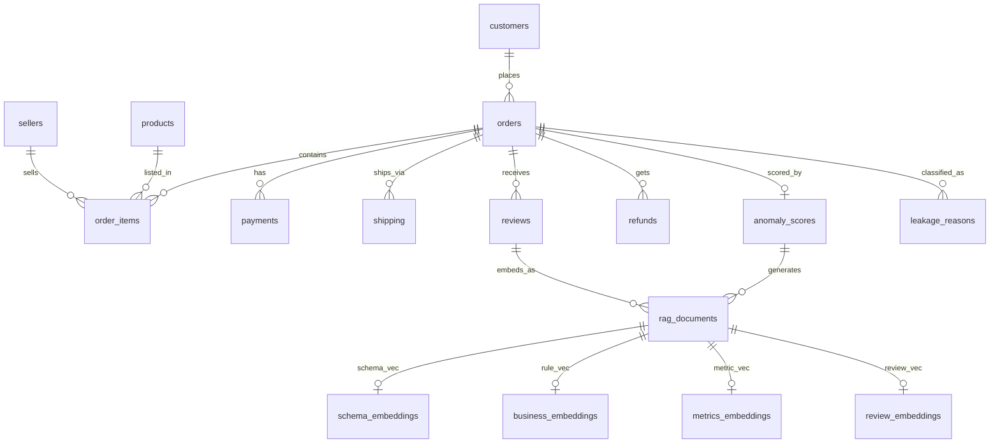
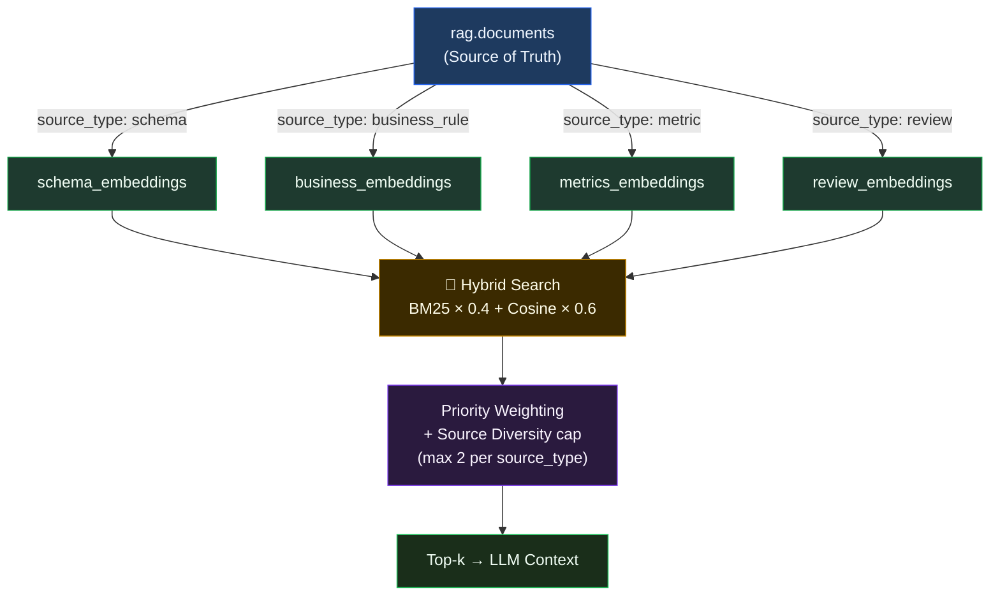
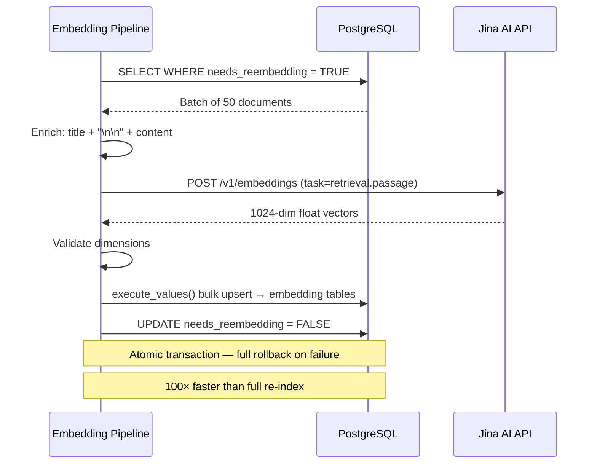
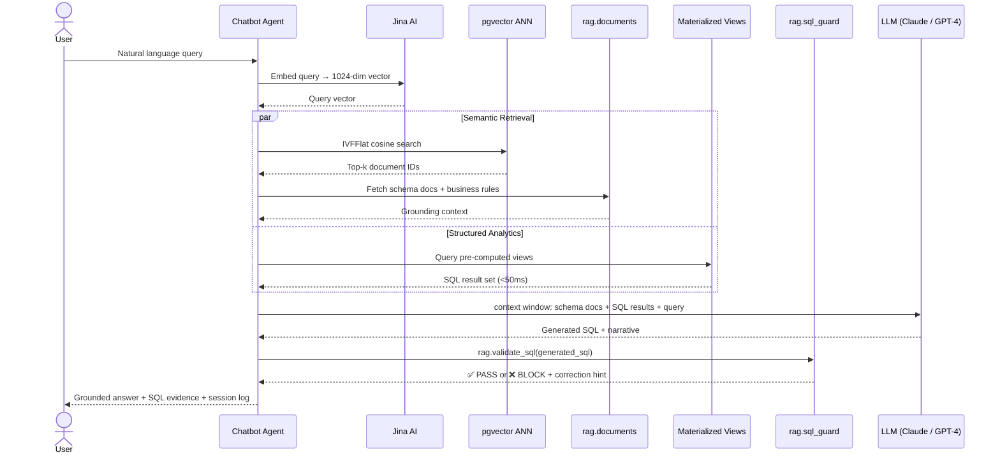

<div align="center">

<picture>
  <source media="(prefers-color-scheme: dark)" srcset="docs/assets/banner-dark.png">
  
</picture>

<br/><br/>

# Revenue Intelligence RAG Platform

**Production AI infrastructure for real-time revenue leakage detection, semantic search, and natural-language analytics — built entirely inside PostgreSQL.**

<br/>

<a href="#-quick-start"></a>
<a href="#-architecture"></a>
<a href="#-live-demo"></a>

<br/><br/>

[](https://www.postgresql.org/)
[](https://github.com/pgvector/pgvector)
[](https://python.org)
[](https://jina.ai)
[](https://docker.com)
[](LICENSE)

<br/>

| | |
|:---:|:---:|
| **2.9M+** records | **1,024-dim** vectors |
| **< 50ms** MV queries | **20** leakage scenarios |
| **4** schemas | **37K+** embedded documents |
| **~10ms** ANN search | **13** SQL guard rules |

<br/>

[Architecture](#-architecture) · [Database Design](#-database-design) · [Vector & RAG](#-vector-database--rag) · [SQL Agent](#-sql-agent--chatbot) · [Performance](#-performance) · [Setup](#-quick-start) · [Queries](#-example-queries) · [Roadmap](#-roadmap)

</div>

---

## The Core Insight

> **Traditional databases store revenue data. This system understands it.**

Revenue leakage is invisible in conventional reporting. Duplicate refunds, undelivered shipments that show as paid, negative-margin discounts — none of these trigger SQL alerts because nobody knows which query to write.

This platform combines:

- **Isolation Forest + LOF ensemble scoring** to flag anomalous orders automatically
- **pgvector semantic search** so analysts can ask questions in plain language
- **Pre-computed materialized views** that serve chatbot agents in under 50ms
- **SQL guardrails** that block hallucinated columns and injection patterns before execution
- **Incremental embedding pipelines** that re-process only changed documents

All of it in a single PostgreSQL 17 container. No data warehouse. No separate vector database. No ML service. One source of truth.

---

## 🏗 Architecture

### System Layers

```
┌─────────────────────────────────────────────────────────────────┐
│                     AI CHATBOT AGENT                            │
│          Natural language → SQL → Grounded response             │
└────────────────────────┬────────────────────────────────────────┘
                         │
┌────────────────────────▼────────────────────────────────────────┐
│                  rag  schema  (Vector Layer)                     │
│   documents · schema_embeddings · business_embeddings           │
│   metrics_embeddings · review_embeddings · sql_guard            │
│   retrieval_cache · retrieval_log · hybrid_search()             │
└────────────────────────┬────────────────────────────────────────┘
                         │
┌────────────────────────▼────────────────────────────────────────┐
│              ml_output  schema  (Intelligence Layer)            │
│   order_anomaly_scores · order_leakage_reasons                  │
│   mv_leakage_dashboard · mv_monthly_leakage                     │
│   mv_seller_risk · mv_leakage_by_scenario                       │
│   chatbot_conversations · chatbot_query_log                     │
└────────────────────────┬────────────────────────────────────────┘
                         │
┌────────────────────────▼────────────────────────────────────────┐
│            ecommerce  schema  (Transactional Core)              │
│   orders · customers · order_items · payments                   │
│   shipping · reviews · refunds · products · sellers             │
└────────────────────────┬────────────────────────────────────────┘
                         │
┌────────────────────────▼────────────────────────────────────────┐
│             marketing  schema  (Attribution Layer)              │
│   campaigns · website_sessions · customer_interactions          │
│   leads_qualified · leads_closed · campaign_attribution         │
└─────────────────────────────────────────────────────────────────┘
```

### End-to-End Data Flow


### Why One Container Beats Three Services

| What you'd normally need | What this system uses |
|:---|:---|
| ❌ Data warehouse for aggregate analytics | ✅ 4 materialized views, CONCURRENT refresh |
| ❌ Pinecone / Qdrant for vector search | ✅ pgvector, native SQL joins |
| ❌ Separate ML scoring service | ✅ Pre-computed `order_anomaly_scores` table |
| ❌ ETL pipeline between systems | ✅ Embeddings live next to transactional rows |
| ❌ Standalone chatbot backend | ✅ `sql_guard` + `chatbot_readonly` role in-DB |

---

## 🗄 Database Design

### Full Schema ERD



---

### `ecommerce` — Transactional Core

<details>
<summary><b>View table breakdown</b> (9 tables · ~1.6M rows)</summary>

| Table | Rows | Key Engineering |
|:---|---:|:---|
| `orders` | 298K | GENERATED cols: `order_month`, `order_quarter`, `fee_to_cost_ratio` |
| `customers` | 253K | `lifetime_value` · `segment` · `churn_risk` ENUM typed |
| `order_items` | 435K | `price_after_discount` — the only correct revenue column |
| `payments` | 297K | `payment_sequential = 1` filter prevents installment duplication |
| `shipping` | 298K | `fee_to_cost_ratio` GENERATED for anomaly detection |
| `reviews` | 262K | `sentiment` ENUM · `has_comment` boolean flag |
| `refunds` | 7.8K | `duplicate_refund` · `processed_before_cancel` boolean flags |
| `products` | 50K | `unit_price_egp` vs actual `price_after_discount` divergence tracking |
| `sellers` | 5K | `return_rate` · `payment_disputes` as structural risk signals |

</details>

> [!WARNING]
> **Critical anti-pattern:** `price` ≠ revenue. Always use `price_after_discount` for financial calculations. This is enforced via `sql_guard` and documented in RAG to prevent LLM hallucination.

---

### `ml_output` — Intelligence Layer

<details>
<summary><b>View components</b> (scoring tables + 4 materialized views)</summary>

| Component | Purpose | Performance |
|:---|:---|:---|
| `order_anomaly_scores` | Isolation Forest + LOF ensemble | One row per order · sub-second lookup |
| `order_leakage_reasons` | Junction table for 20 scenarios | GIN-indexed · faster than `ANY(array)` |
| `mv_leakage_dashboard` | Pre-JOINed order view | **< 50ms** · zero runtime JOINs |
| `mv_monthly_leakage` | Monthly aggregates | `leakage_rate_pct` fully pre-computed |
| `mv_seller_risk` | Seller risk profiles | Pre-sorted `leakage_rate_pct DESC` |
| `mv_leakage_by_scenario` | Revenue-at-risk per scenario | Financial impact by leakage type |
| `chatbot_conversations` | Multi-turn session history | Reconstructed via `session_id` + `turn_index` |
| `chatbot_query_log` | Full observability | Cost · latency · hallucination flags |
| `chatbot_prompt_versions` | A/B tested system prompts | `auc_score` · `avg_f1` tracked per version |

</details>

---

### `rag` — Vector & Retrieval Engine

<details>
<summary><b>View components</b> (4 typed embedding tables + cache + guard)</summary>

| Component | Dim | Purpose |
|:---|:---:|:---|
| `schema_embeddings` | 1024 | Table schemas · join graphs · ENUM references |
| `business_embeddings` | 1024 | Leakage scenarios · detection rules |
| `metrics_embeddings` | 1024 | KPI definitions · anomaly interpretations |
| `review_embeddings` | 1024 | Customer feedback · sentiment patterns |
| `retrieval_cache` | — | `query_hash → result_json` · 24h TTL |
| `retrieval_log` | — | Hallucination tracking · confidence scores |
| `sql_guard` | — | 13 pattern rules · injection prevention |

</details>

---

### `marketing` — Attribution Pipeline

<details>
<summary><b>View tables</b> (6 tables · ~1.7M rows)</summary>

| Table | Rows | Purpose |
|:---|---:|:---|
| `marketing_campaigns` | 184 | Campaign definitions with budget |
| `leads_qualified` | 24K | Marketing-qualified leads |
| `leads_closed` | 7.2K | Won deals with revenue |
| `campaign_attribution` | 208K | Order-to-campaign mapping |
| `website_sessions` | 1.26M | Session logs with bounce detection |
| `customer_interactions` | 1M | Cross-channel event stream |

</details>

---

## 🔍 Vector Database & RAG

### Embedding Architecture



### Document Types & Priorities

| `source_type` | Count | `embedding_type` | Priority | Function |
|:---|---:|:---|:---:|:---|
| `sql_template` | 7 | `sql_template` | **10** | Pre-built query patterns for agents |
| `schema_doc` | 12 | `schema` | 7–10 | Table schemas · join graphs · ENUMs |
| `leakage_scenario` | 20 | `business_rule` | 7–10 | Detection rules per scenario |
| `kpi_glossary` | 4 | `metric` | 7–9 | Business metric definitions |
| `leakage_reason` | ~37K | `business_rule` | 3–8 | Per-order leakage reports |
| `review` | 30K | `review` | 2–5 | Customer feedback + sentiment |

### Hybrid Search — Core Algorithm

```sql
-- BM25 (keyword) × 0.4  +  Cosine Similarity (vector) × 0.6
-- with source-type diversity enforcement
WITH bm25 AS (
    SELECT doc_id,
           ts_rank_cd(content_tsv, plainto_tsquery('english', :query)) AS score
    FROM   rag.documents
    WHERE  content_tsv @@ plainto_tsquery('english', :query)
),
vec AS (
    SELECT doc_id,
           1 - (embedding <=> :query_vec) AS score
    FROM   rag.schema_embeddings   -- UNION ALL business, metrics, review
),
fused AS (
    SELECT COALESCE(b.doc_id, v.doc_id)        AS doc_id,
           COALESCE(b.score, 0) * 0.4
         + COALESCE(v.score, 0) * 0.6          AS hybrid_score
    FROM bm25 b FULL JOIN vec v USING (doc_id)
)
SELECT d.*, f.hybrid_score
FROM   fused f
JOIN   rag.documents d USING (doc_id)
WHERE  d.is_active = TRUE
ORDER  BY f.hybrid_score DESC, d.priority DESC
LIMIT  8;
```

### Incremental Embedding Pipeline



> [!TIP]
> The `needs_reembedding` flag means only *changed* documents are re-processed. On a 37K-document corpus, this reduces pipeline runtime from ~12 minutes to under 10 seconds on incremental updates.

---

## 🤖 SQL Agent & Chatbot

### Full Query Lifecycle



### Intent → Data Source Routing

```mermaid
flowchart TD
    Q[User Query] --> I{Intent\nClassification}

    I -->|simple_lookup|         MV1[mv_leakage_dashboard]
    I -->|aggregation|           MV2[mv_leakage_by_scenario]
    I -->|trend_analysis|        MV3[mv_monthly_leakage]
    I -->|seller_risk|           MV4[mv_seller_risk]
    I -->|anomaly_investigation| RAG[Hybrid RAG Search]
    I -->|sentiment_analysis|    RE[review_embeddings]

    MV1 & MV2 & MV3 & MV4 --> SQL[SQL Generation]
    RAG & RE --> CTX[Context Injection]

    SQL --> G{sql_guard\nValidation}
    CTX --> LLM[LLM Response]

    G -->|PASS|  EX[Execute + Log]
    G -->|BLOCK| ER[Error + Suggestion]

    EX --> LLM
    LLM --> R[Response to User]

    style G   fill:#78350f,stroke:#f59e0b,color:#fef3c7
    style ER  fill:#7f1d1d,stroke:#ef4444,color:#fef2f2
    style R   fill:#14532d,stroke:#22c55e,color:#f0fdf4
```

### SQL Guard in Action

```sql
-- Validate LLM-generated SQL before any execution
SELECT * FROM rag.validate_sql(
    'SELECT SUM(orders.amount) FROM ecommerce.payments WHERE order_id = $1'
);
```

```
 error_type  │  token          │  message
─────────────┼─────────────────┼─────────────────────────────────────────────
 fake_column │ orders.amount   │ Column does not exist. Did you mean
             │                 │ orders.total_revenue?
```

The `chatbot_readonly` role enforces hard limits at the database level:

```sql
-- Role created at schema install time
CREATE ROLE chatbot_readonly NOLOGIN;
GRANT USAGE ON SCHEMA ecommerce, ml_output, rag TO chatbot_readonly;
GRANT SELECT ON ALL TABLES IN SCHEMA ml_output TO chatbot_readonly;
ALTER ROLE chatbot_readonly SET statement_timeout = '15s';
-- INSERT / UPDATE / DELETE / DROP → permission denied, always
```

---

## ⚡ Performance

### Index Architecture

| Index | Table / Column | Strategy | Gain |
|:---|:---|:---|:---|
| **IVFFlat** | `*_embeddings.embedding` | `lists=100` ANN search | 4× faster · 98% recall |
| **BRIN** | `orders.order_purchase_timestamp` | 128 pages/range | 300× smaller than B-tree |
| **Partial** | `anomaly_flag = 1` | Index only leakage rows | Fraction of full index size |
| **Partial** | `shipping_status = 'never_shipped'` | Target specific failure mode | Near-instant filter |
| **GIN** | `leakage_scenarios[]` | Array element lookup | Fast `= ANY()` queries |
| **GIN** | `documents.content_tsv` | Full-text BM25 | Hybrid retrieval keyword leg |

### Benchmark Summary

```
┌─────────────────────────────────────────────────────────────────────┐
│                     PERFORMANCE PROFILE                             │
├──────────────────────────────────┬──────────────┬───────────────────┤
│  Metric                          │  Value       │  Technique        │
├──────────────────────────────────┼──────────────┼───────────────────┤
│  Materialized view query         │  < 50ms      │  Pre-JOINed MVs   │
│  Vector ANN search (260K vecs)   │  ~10ms       │  IVFFlat l=100    │
│  Retrieval cache hit             │  < 1ms       │  query_hash dedup │
│  Embedding pipeline (37K docs)   │  ~12 min     │  50 docs/batch    │
│  Incremental re-embed            │  < 10s       │  needs_reembedding│
│  IVFFlat complexity              │  O(√n)       │  centroid probing │
│  BRIN vs B-tree size             │  300× smaller│  128 pg/range     │
└──────────────────────────────────┴──────────────┴───────────────────┘
```

### Materialized View Refresh

```sql
-- CONCURRENTLY: reads continue unblocked during refresh
CALL ml_output.refresh_all_views();

-- Chatbot always hits the MV, never raw tables
SELECT order_id, customer_name, risk_tier, ensemble_score,
       leakage_scenarios, total_revenue, profit_margin
FROM   ml_output.mv_leakage_dashboard
WHERE  anomaly_flag = 1
AND    risk_tier    = 'Critical'
ORDER  BY ensemble_score DESC
LIMIT  50;
-- ↳ 0 runtime JOINs. Returns in < 50ms.
```

---

## 📁 Project Structure

```
revenue-intelligence-rag/
│
├── schema/
│   ├── ecommerce_schema.sql           # Core tables + CSV ingestion
│   ├── vector_db_RAG.sql              # RAG schema + documents + functions
│   ├── ml_data_modification.sql       # ML scoring + materialized views
│   └── final.sql                      # Import orchestration script
│
├── schema_output/                     # Auto-generated agent context
│   ├── llm_schema_context.txt         # ★ Runtime context injected into LLM (~38KB)
│   ├── DATABASE_DOCUMENTATION.md      # Human-readable schema reference (~37KB)
│   ├── rag_documents.json             # Enriched RAG source documents
│   ├── columns.json                   # All columns + comments + GENERATED flags
│   ├── enums.json                     # 14 ENUM types with valid values
│   ├── foreign_keys.json              # Full relationship map
│   ├── indexes.json                   # Index definitions + partial conditions
│   ├── materialized_views.json        # MV structure + column comments
│   ├── sample_rows.json               # Anonymized sample data
│   ├── schema_metadata.json           # Chatbot table-selection guide
│   └── chatbot_enums.json             # ENUM values for LLM prompt injection
│
├── pipeline/
│   ├── extract_schema.py              # Schema extraction + context builder
│   └── embedding_pipeline.py          # Jina AI → pgvector incremental sync
│
├── erds/
│   ├── full_schemas.png               # Complete 4-schema ERD
│   ├── ecommerce_schema_erd.html      # Interactive ecommerce diagram
│   ├── ml_output_schema_erd.html      # Interactive ML diagram
│   └── rag_schema_erd.html            # Interactive RAG diagram
│
├── docker/
│   └── docker-compose.yml             # PostgreSQL 17 + pgvector
│
├── docs/
│   └── ARCHITECTURE_DECISIONS.md      # ADRs for every major design choice
│
└── README.md
```

---

## 🚀 Quick Start

### Prerequisites

| Tool | Version |
|:---|:---|
| Docker | 24.0+ |
| Python | 3.11+ |
| Jina AI API key | [Get free key →](https://jina.ai) |

### 1 — Start the database

```bash
docker pull pgvector/pgvector:pg17

docker run -d \
  --name revenue-rag \
  -p 5433:5432 \
  -e POSTGRES_PASSWORD=postgres \
  -e POSTGRES_DB=revenue_leakage \
  -v pgdata:/var/lib/postgresql/data \
  pgvector/pgvector:pg17

# Confirm extension is active
docker exec -it revenue-rag \
  psql -U postgres -d revenue_leakage \
  -c "CREATE EXTENSION IF NOT EXISTS vector;"
```

### 2 — Install schemas

```bash
psql -h localhost -p 5433 -U postgres -d revenue_leakage

\i schema/ecommerce_schema.sql       -- core tables + data
\i schema/vector_db_RAG.sql          -- RAG engine + documents
\i schema/ml_data_modification.sql   -- ML scores + materialized views
```

### 3 — Configure the embedding pipeline

```python
# pipeline/embedding_pipeline.py

JINA_API_KEY = "jina_..."                        # paste your key
JINA_MODEL   = "jina-embeddings-v5-text-small"   # 1024-dim

DB_CONFIG = {
    "dbname": "revenue_leakage", "user": "postgres",
    "password": "postgres", "host": "localhost", "port": "5433"
}

BATCH_SIZE  = 50   # documents per API call
MAX_RETRIES = 3    # exponential backoff on rate-limit
```

### 4 — Run the pipeline

```bash
cd pipeline && python embedding_pipeline.py
```

```
INFO  Found 37,266 documents pending embedding
INFO  Embedding dimension: 1024 ✓
INFO  Batch   1/746  │  processed:     50 / 37,266
INFO  Batch   2/746  │  processed:    100 / 37,266
  ···
INFO  ══════════════════════════════════
INFO  COMPLETE — 37,266 embedded · 0 errors
```

### 5 — Verify

```sql
-- Row counts by source type
SELECT source_type, COUNT(*)
FROM   rag.documents
GROUP  BY 1
ORDER  BY 2 DESC;

-- Confirm embeddings are populated
SELECT e.embedding_type, COUNT(*)
FROM   rag.schema_embeddings e
JOIN   rag.documents d USING (doc_id)
GROUP  BY 1;

-- Live hybrid search smoke test
SELECT * FROM rag.hybrid_search(
    'duplicate refund detection', NULL, NULL, 5
);
```

> [!NOTE]
> Full pipeline on 37K documents takes ~12 minutes on first run. Subsequent incremental syncs (changed documents only) complete in under 10 seconds.

---

## 📝 Example Queries

### Semantic vector search

```sql
-- Schema docs most similar to "seller payment risk"
SELECT d.title,
       1 - (e.embedding <=> :query_vec) AS similarity,
       d.content
FROM   rag.schema_embeddings e
JOIN   rag.documents d USING (doc_id)
WHERE  d.source_type = 'schema_doc'
ORDER  BY e.embedding <=> :query_vec
LIMIT  5;
```

### Hybrid BM25 + vector retrieval

```sql
SELECT * FROM rag.hybrid_search(
    p_query         := 'high discount driving negative margin',
    p_source_types  := ARRAY['leakage_scenario','sql_template']::rag.rag_source_t[],
    p_embedding     := :query_vec,
    p_top_k         := 8,
    p_vector_weight := 0.6,
    p_bm25_weight   := 0.4
);
```

### Critical anomaly dashboard

```sql
-- Zero JOINs. Pre-computed. Sub-50ms.
SELECT order_id, customer_name, customer_city,
       total_revenue, profit_margin, risk_tier,
       ensemble_score, leakage_scenarios,
       payment_status, shipping_status
FROM   ml_output.mv_leakage_dashboard
WHERE  anomaly_flag = 1
AND    risk_tier    = 'Critical'
AND    order_month >= DATE_TRUNC('month', NOW() - INTERVAL '3 months')
ORDER  BY ensemble_score DESC
LIMIT  20;
```

### Seller risk leaderboard

```sql
SELECT seller_name, seller_city,
       leakage_rate_pct, total_orders,
       leakage_orders, avg_anomaly_score,
       payment_disputes, return_rate
FROM   ml_output.mv_seller_risk
WHERE  total_orders > 100          -- statistical significance
ORDER  BY leakage_rate_pct DESC
LIMIT  10;
```

### 12-month leakage trend

```sql
SELECT month_label, total_orders, leakage_orders,
       ROUND(leakage_rate_pct, 2) AS leakage_rate_pct,
       total_revenue, revenue_at_risk
FROM   ml_output.mv_monthly_leakage
ORDER  BY month DESC
LIMIT  12;
```

---

## 🧠 Engineering Decisions

<details>
<summary><b>Why pgvector instead of Pinecone or Qdrant?</b></summary>

Embeddings live in the same ACID transaction as the business data they describe. A single SQL query can join a cosine similarity score with order revenue, customer churn risk, and leakage scenario — no ETL, no sync lag. For an existing PostgreSQL team, the operational cost is zero.

**Trade-off:** Billion-scale vectors may need Citus sharding or a read replica for the vector workload. Migration path is documented in `docs/ARCHITECTURE_DECISIONS.md`.

</details>

<details>
<summary><b>Why IVFFlat over HNSW?</b></summary>

At 260K vectors, IVFFlat with `lists=100` delivers 98% recall at 4× the speed of exact search, with dramatically faster build times during the batch embedding pipeline. HNSW achieves higher recall at extreme scale but takes longer to build and consumes more memory.

**Trade-off:** HNSW is the right migration target beyond ~10M vectors. The switchover is a single `CREATE INDEX` statement.

</details>

<details>
<summary><b>Why four embedding tables instead of one?</b></summary>

PostgreSQL's query planner can maintain a dedicated IVFFlat index per table. When the chatbot asks a schema question, it queries only `schema_embeddings` — not a 37K-row union. This makes retrieval faster, routing cleaner, and partial re-indexing trivial.

**Trade-off:** Slightly more complex schema, managed entirely via `EMBEDDING_TABLE_MAP` in the pipeline.

</details>

<details>
<summary><b>Why materialized views instead of regular views?</b></summary>

The chatbot never touches raw tables. Every analytical query hits a pre-JOINed, pre-aggregated materialized view with its own indexes. `REFRESH CONCURRENTLY` means reads are never blocked during refresh cycles.

**Trade-off:** Data freshness is bounded by the refresh schedule. `pg_cron` handles daily refresh. Critical inserts can trigger manual refresh via `CALL ml_output.refresh_all_views()`.

</details>

<details>
<summary><b>Why bilingual AR+EN documents?</b></summary>

The target market is Egypt. Business users query in Arabic; engineers query in English. All RAG documents carry `content_lang = 'ar+en'` and are indexed with dual `to_tsvector('arabic', ...)` + `to_tsvector('english', ...)` columns, so BM25 retrieval works correctly in both languages without document duplication.

</details>

---

## 🔮 Roadmap

```
Phase 1  ✅  Core database · ML scoring · pgvector RAG · sql_guard
Phase 2  🚧  Chatbot agent wired to Claude/GPT-4 · text-to-SQL · session logging
Phase 3  📋  Real-time dashboard (Streamlit / Next.js) · pg_cron auto-refresh
Phase 4  📋  PostgreSQL NOTIFY/LISTEN alerting · Slack/email webhooks
Phase 5  🔮  Multi-tenant SaaS · row-level security · Citus horizontal scaling
```

### Advanced RAG techniques

| Technique | Status | Expected lift |
|:---|:---:|:---|
| Cross-Encoder Re-ranking | 📋 Planned | +15% retrieval precision |
| Hypothetical Document Embeddings (HyDE) | 📋 Planned | Better query–document alignment |
| Agentic RAG with feedback loops | 🔮 Future | Self-improving retrieval |
| Multi-modal embeddings | 🔮 Future | Image + text product search |
| Distributed vectors (Citus) | 🔮 Future | Billion-scale ANN |

---

## 🤝 Contributing

```bash
# Fork → clone → branch
git clone https://github.com/your-org/revenue-intelligence-rag.git
git checkout -b feat/your-feature

# Make changes, then open a PR against main
```

**Good first contributions:** new leakage scenario documents · additional `sql_guard` rules · HyDE retrieval experiment · Streamlit dashboard prototype · test coverage for `hybrid_search()`.

Please read `docs/ARCHITECTURE_DECISIONS.md` before modifying any schema.

---

## 📄 License

MIT — see [LICENSE](LICENSE).

---

## 👤 Author

**Mohamed Waleed Elmasry**
AI Engineer & Database Architect

[](https://github.com/MohamedWaleedElmasry)
[](https://www.linkedin.com/in/mohamedwaleed-data/)

---

<div align="center">

<br/>

**One container. One source of truth. Production-grade AI infrastructure.**

<br/>

[](https://postgresql.org)
[](https://github.com/pgvector/pgvector)
[](https://python.org)
[](https://jina.ai)
[](https://docker.com)

<br/>

*Revenue Intelligence Platform v3.1 · Built by [Mohamed Waleed Elmasry](https://github.com/MohamedWaleedElmasry)*

</div>
